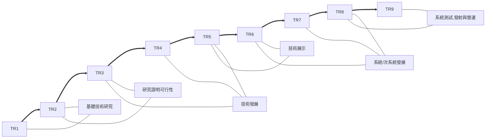

標籤: #satellite 

---

也稱為技術就緒指數(TRL)

```mermaid
flowchart LR

TR1 ==> TR2 ==> TR3 ==> TR4 ==> TR5 ==> TR6 ==> TR7 ==> TR8 ==> TR9


TR1 --- 基礎技術研究
TR2 --- 基礎技術研究

TR2 --- 研究證明可行性
TR3 --- 研究證明可行性

TR3 --- 技術發展
TR4 --- 技術發展
TR5 --- 技術發展

TR5 --- 技術展示
TR6 --- 技術展示

TR6 --- 系統/次系統發展
TR7 --- 系統/次系統發展
TR8 --- 系統/次系統發展

TR8 --- 系統測試,發射與營運
TR9 --- 系統測試,發射與營運
```

---

參考資料:

衛星科技與工程概論