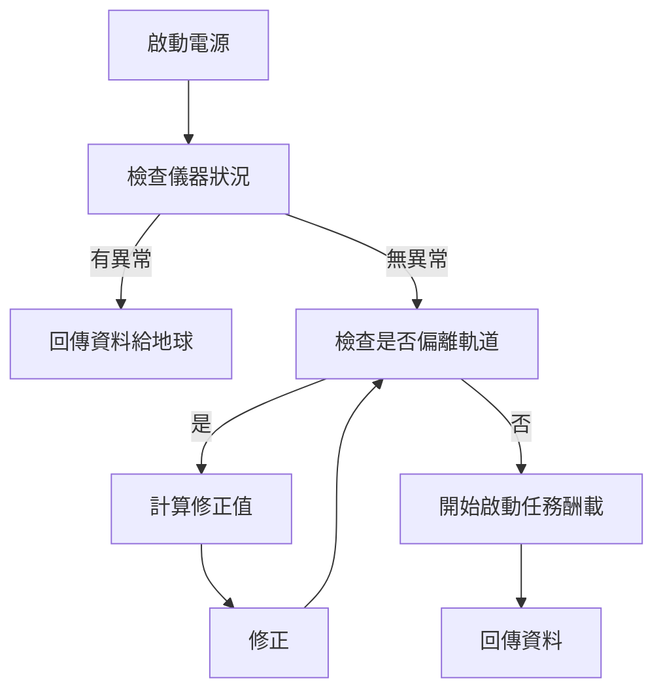

> 參考第十組
# Siaolin Village Satellite

In memory of siaolin village

Presented by Group 2 (SVS)

---

# Content

1. [[#Group Member]]
2. [[#Introduction]]
3. [[#Mission]]
4. [[#Division of Work]]
5. [[#Mode]]
6. [[#Requirement]]

---

# Group Member
| 人員   | 學號      |
| ------ | --------- |
| 吳典謀 | 109611066 |
| 張瀚元 | 109611004 |
| 陳柏文 | 109611030 |
| 黃熙漢 | 109611104 |
| 李睿衡 | 110611064 |

---

# Introduction

## Mission Objective

We will analyze waters in real-time. Then we will predict and report places that have higher chance of flood.

---

## Dimension

==TODO==

---

## Mass

==TODO==

---

## Payload

- 光學鏡頭

---

# Mission

## Target

![[台灣圈圈.png]]

---

## Mission Goal

- Mission Objectives: We will analyze waters in real-time. Then we will predict and report places that have higher chance of flood.
- Objective Deliverable: 比對平常時的空照圖和即將發生土石流的差異，回傳訊號到地表
- Deliverable Requirements: 能拍出不失焦的照片、精確的姿態控制
- Payload: 光學鏡頭，地面解析度 2m
- Payload Requirements: 
	- Voltage: 5V
	- Power: 1.9W
	- Attach with NUC
	- Built-in IMU

---

## Boot Sequence

---

# Division of Work

- Software Design: 吳典謀
- Mechanism Design: 陳柏文
- Optical Module: 黃熙漢
- Electical System: 李睿衡
- Dynamics System: 張瀚元
- Communication System: 吳典謀

---

# Requirement

## Mass Budget

- ADCS: 636g
- NUC: 約 635g
- Battery (18650 $\times$ 6): 249.05g
- Solar Panel: 1.85kg
- nRF24L01 + Antenna: 400g
- Structure: 1kg

---

## 任務層級

Level0: 
拍攝可見光照片回傳地表
Level1: 
要能夠拍攝清楚的照片並完整的傳回地球
繞行軌道大約750km
Level2:
姿態要控制精準，以利完成遙測任務
自主控制電力分工

---

## EPS

> 柏

==TODO: EPS Architecture==
==TODO: Requirement==

---

## C&DH

[NUC](https://www.intel.com.tw/content/www/tw/zh/products/sku/208224/intel-nuc-11-extreme-kit-nuc11btmi7/specifications.html)

---

## COMM

> 漢

==TODO: Receive zone==
==TODO: time chart==
==TODO: Comm Module==

---

## Camera

![[Gekko Imager.png]]

- Gecko imager
- 大小：10 cm x 10 cm x 6.5 cm
- 重量：0.4 kg
- 工作溫度：0ºC to +30ºC 
- 刈幅：80 km
- 地面解析度：39 m
- 功耗：2.6 W；4.5 W

---

## Structure

==TODO: 需求、架構==