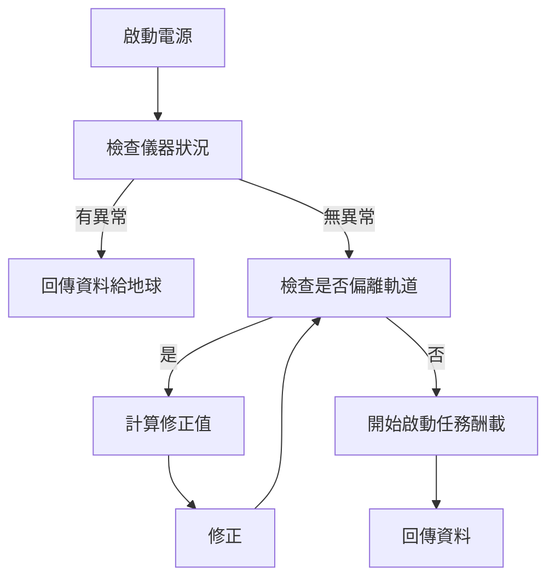

```mermaid
flowchart TB

啟動電源 --> 檢查儀器狀況

檢查儀器狀況 -- 有異常 --> 回傳資料給地球
檢查儀器狀況 -- 無異常 --> 檢查是否偏離軌道

檢查是否偏離軌道 -- 是 --> 計算修正值 --> 修正 --> 檢查是否偏離軌道
檢查是否偏離軌道 -- 否 --> 開始啟動任務酬載 --> 回傳資料
```

![[satellite internal picture.png]]

“Logistics is simple, but not easy.” - Joe Lynch.